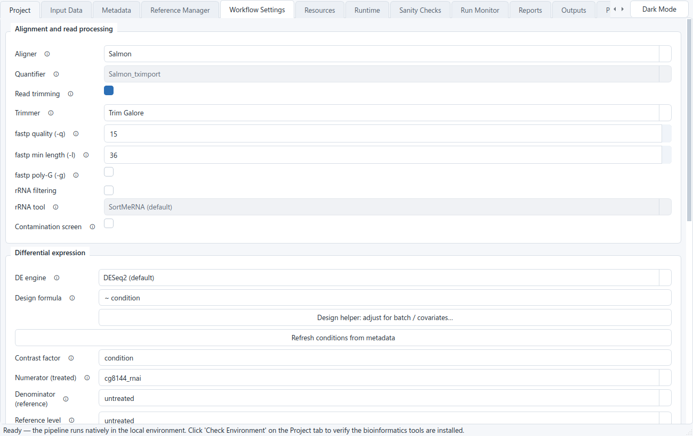
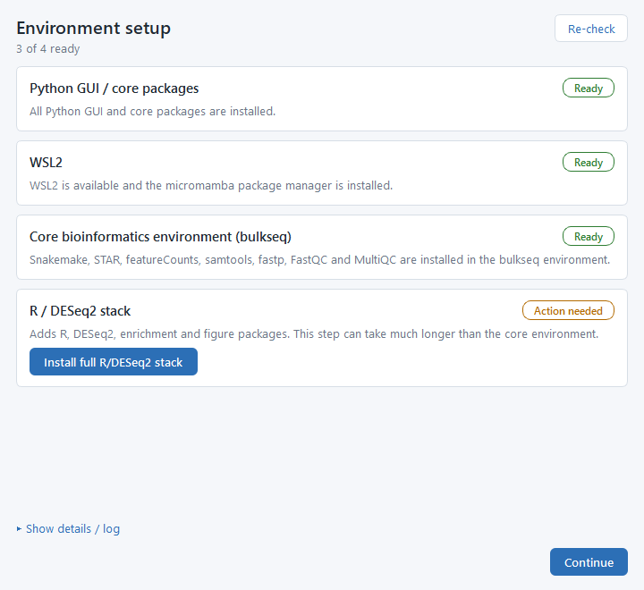
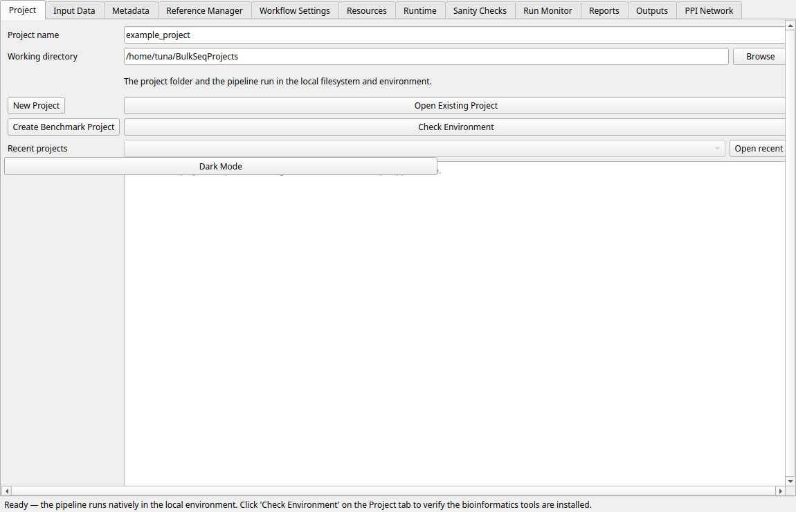
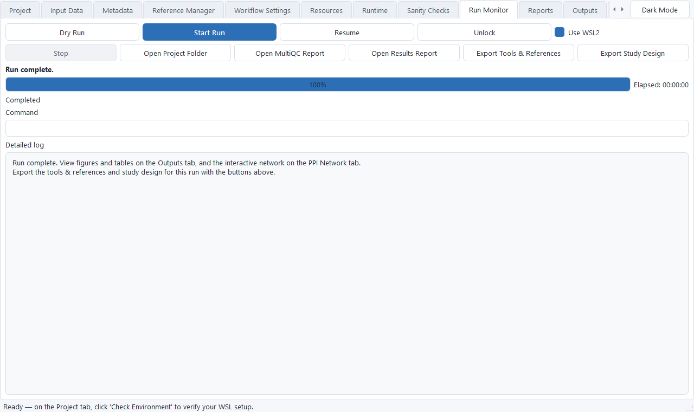
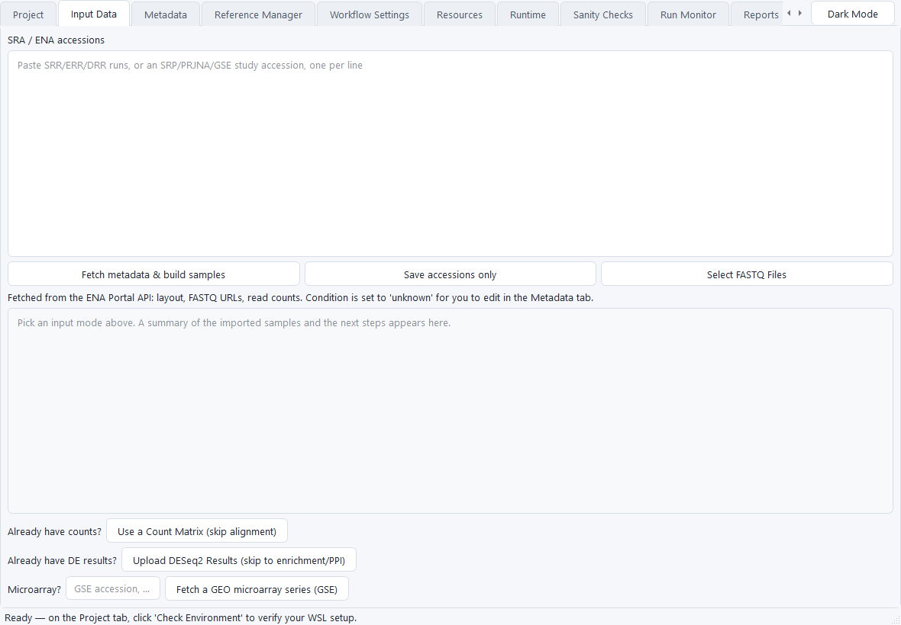

# BulkSeq Studio

A **cross-platform** desktop application (Windows and Linux) for reproducible, reference-based **bulk RNA-seq analysis**, from raw FASTQ/SRA reads to differential expression, functional enrichment, and publication figures, with no command line required.

BulkSeq Studio is a PySide6 GUI that drives a transparent [Snakemake](https://snakemake.github.io/) pipeline — inside WSL2 on Windows, or natively in a local environment on Linux. You point it at your data and a reference; it produces a count matrix, DESeq2 results, GO/KEGG enrichment, and figures, and records the exact parameters, tool versions, and environment so a run can be reproduced later. On Linux the same pipeline runs directly (no WSL); see [Running on Linux](#running-on-linux).


## Features

- **End-to-end pipeline.** ENA/SRA FASTQ download, FastQC/MultiQC, adapter/quality trimming (fastp, Trim Galore, or Trimmomatic), optional rRNA filtering (SortMeRNA or RiboDetector) and contamination screening (FastQ Screen), alignment (STAR, HISAT2, or Salmon), gene counting (featureCounts, STAR gene counts, or Salmon tximport), differential expression (DESeq2, limma-voom, or edgeR), GO/KEGG and custom-gene-set enrichment, optional GSVA pathway activity, and publication figures, orchestrated by Snakemake. Paired-end and single-end reads are both supported.
- **No command line needed.** A tabbed GUI walks you from project setup through metadata, reference selection, a sanity-check gate, and an interactive Outputs browser. The Run Monitor shows a plain-language current phase (Downloading, Aligning, DESeq2, and so on) above the raw log.
- **Choice of aligner.** STAR (default, genome-size-aware index), HISAT2 (graph aligner, small index and low memory, for large crop genomes that overflow STAR), or Salmon (alignment-free transcriptome quantification, lowest memory). The three routes produce a common count matrix, so everything after counting is the same. See [Choosing an aligner](#choosing-an-aligner).
- **Sizes itself to your machine.** Resource recommendations are based on the WSL2 VM's real RAM/CPU caps (not the Windows host total), so memory-heavy steps like STAR do not over-subscribe and thrash. The runtime estimate shown before you start is computed against the cores and RAM this machine will actually use, so it changes with the hardware and with the sequencing volume — not a fixed number.
- **Fetch a study from its accession.** Paste SRR/SRP/PRJ accessions — or an RNA-seq **GSE** series, which is resolved to its SRA runs (via the SRA study or the linked BioProject) — and the ENA metadata fetch builds the sample sheet (layout, FASTQ URLs, read counts) for you. The **condition** column is pre-filled with a suggested experimental group parsed from the metadata (GEO characteristics such as genotype/treatment, or sample-title groups); you confirm or edit it in the Metadata tab. A symbol in the metadata (e.g. a Greek delta in a genotype) never breaks the fetch.
- **Start from a count matrix.** Already have counts? Upload a gene-by-sample table (featureCounts output or any TSV/CSV) to skip download, QC, and alignment and go straight to DESeq2, figures, and enrichment.
- **GEO microarray (GSE).** Enter a GEO series accession; the app ingests the normalized intensities (GEOquery series matrix, or RMA from raw Affymetrix CEL), maps probes to gene symbols, and runs **limma** differential expression, then the same figures, enrichment, and genes-of-interest. RNA-seq series are redirected to the SRA box. No accession — just your own processed array data? Click **Upload a local microarray matrix** and give it a gene × sample expression matrix (already-normalized log2 intensities); it runs the same limma path with no download.
- **Bring your own DESeq2 results.** Upload a differential-expression table to run enrichment, the volcano / MA / p-value figures, and the STRING PPI network directly, with no FASTQ, alignment, or counts. See [Bring your own DESeq2 results](#bring-your-own-deseq2-results).
- **Three differential-expression engines.** DESeq2 is the default (apeglm shrinkage, VST, configurable `alpha` and `|log2FC|` thresholds, separate up- and down-regulated gene lists). Optional **limma-voom** and **edgeR quasi-likelihood** engines are provided as cross-checks, best suited to larger designs; all three emit the same result tables and figures, so everything downstream is identical. DESeq2 remains the default and its results are unchanged (validated log2FC correlation ≈ 0.997–1.000 and top-DEG Jaccard 0.94–0.97 against DESeq2 on *Fusarium graminearum*).
- **Choice of trimmer, rRNA tool, and a contamination screen.** Adapter/quality trimming with **fastp** (default), **Trim Galore**, or **Trimmomatic**; optional ribosomal-RNA removal with **SortMeRNA** (reference-based, default) or **RiboDetector** (reference-free); and an optional **FastQ Screen** contamination report (percentage of reads matching a panel of reference genomes) that lands in the MultiQC report. FastQ Screen runs against a config file you point it at (Advanced parameters → Contamination: FastQ Screen config); it does not auto-download a genome panel. The defaults (fastp, SortMeRNA) are unchanged, so existing results are unaffected.
- **Single-end and paired-end input.** Both layouts run the full pipeline through every trimmer, aligner, and rRNA tool; the app detects the layout from the sample sheet and blocks a mixed-layout run with guidance.
- **GSVA pathway activity.** Optional sample-level gene-set activity scores (GSVA) computed against your own custom gene sets, with a per-sample heatmap. Organism-safe: it uses only your gene sets, so it is valid for non-model organisms. Descriptive scores, not a significance test.
- **Extended alignment QC (RSeQC).** An optional read genomic-context distribution (exon / intron / intergenic) and 5′→3′ gene-body coverage, added to the MultiQC report (genome-BAM routes only).
- **Advanced parameters, exposed.** A collapsible Advanced parameters panel on the Workflow tab surfaces the important knobs of every tool (fastp, Trimmomatic, RiboDetector, FastQ Screen, STAR, featureCounts, DESeq2), with the validated defaults pre-filled so a run reproduces the standard behaviour unless you change them.
- **Self-contained HTML report + design helper.** One shareable HTML results report serves both a non-specialist and a bioinformatician from a single self-contained file (no external assets): each section opens with a plain-language finding — what was compared, how many genes changed and in which direction, the strongest genes — with the statistics glossed inline and collected in an end glossary, above the full tables and figures with their exact numbers; figures are grouped and lettered (Quality / Differential expression / Function) with a plain caption and a technical caption each. A **Design helper** composes the DESeq2 design formula from your metadata columns without typing R: tick the nuisance variables you want to adjust for (batch, sequencing run, donor, sex, and so on) and it builds an additive formula such as `~ batch + condition`, putting the effect of interest last. Accounting for these known covariates removes their variation from the comparison, so a batch or donor difference is not mistaken for the treatment effect. See [The design helper: adjusting for batch and covariates](#the-design-helper-adjusting-for-batch-and-covariates).
- **Mitochondrial and chloroplast gene handling.** Organellar transcripts can dominate library size and skew normalization. On the Workflow tab you choose to keep them, discard them before differential expression, or analyse them separately (the main DE runs on nuclear genes only; a separate organellar count subset and a per-sample organellar-fraction table are written). Organellar contigs are detected from the reference (mitochondrion and chloroplast/plastid), so it works for plants and animals without a gene list.
- **Directional functional enrichment.** GO over-representation and GSEA (clusterProfiler) run separately on the up- and down-regulated sets. Selecting an organism preset auto-configures its enrichment databases and STRING taxon, so KEGG pathway ORA and GSEA run for any organism with a KEGG code (fungi, bacteria, yeast, for example *Fusarium graminearum*, code `fgr`), and GO and Reactome are available without a Bioconductor OrgDb through g:Profiler (`gprofiler2`). Organisms with an installed OrgDb (human, mouse, fly) use clusterProfiler and additionally get disease-ontology terms, so an organism is not skipped for lacking an OrgDb. Enrichment figures (GO and KEGG dotplots, GSEA running-score, ridgeplot, gene-concept and term-similarity networks) use enrichplot / ggplot2. You can also supply your own gene sets — a GMT and/or an id→term annotation table, with an optional background list for the ORA universe — for a custom over-representation + GSEA run alongside GO/KEGG (the gene IDs must match the run's identifier format; a mismatch is flagged).
- **Interactive protein-interaction network.** A dedicated PPI Network tab embeds the STRING network in an interactive [cytoscape.js](https://js.cytoscape.org/) view: hover a protein for its symbol, mean expression, log2 fold-change, adjusted p-value, degree, and module; drag, zoom, and re-layout (fcose/cose/circle and others); recolour by fold-change or module; resize by degree, expression, or significance; filter by confidence; and export PNG or SVG (white or transparent background). The network also exports to Cytoscape (GraphML, SIF, cytoscape.js JSON) for external editing.
- **More statistics.** Sample-to-sample correlation heatmaps (Pearson and Spearman's ρ), a Wilcoxon rank-sum concordance diagnostic, TOST equivalence testing to flag genuinely unchanged genes, MSigDB Hallmark set-overlap, and disease-ontology (DO) enrichment for human and mouse.
- **Genes of interest.** Supply a gene list to get a focused z-scored heatmap, a per-condition expression panel, and a counts table — and a STRING network for those genes when PPI seeding is set to the list — generated from an existing run without re-analysis. The IDs are matched to the run's genes by locus tag, Ensembl/RefSeq ID, or symbol; any that do not match are flagged with examples of the run's ID format.
- **Enrichment term → genes.** The Enrichment Terms tab turns any enriched GO term or KEGG pathway into its member genes: pick a term to get a sortable table of those genes with their full DESeq2 statistics, and a focused z-scored heatmap for just those genes — instantly, from the finished run, no re-analysis. Resolves GO symbols and KEGG NCBI gene ids; the table works even for a DESeq2-results upload.
- **Publication figures.** PCA, sample-distance, MA, volcano, a combined top-DEG heatmap, separate **up-** and **down-regulated** top-DEG heatmaps, a raw p-value histogram, and (RNA-seq) dispersion / Cook's-distance / library-size diagnostics, each exported as PNG (raster) and SVG (vector, with an in-app preview toggle). A built-in **Figure Style** editor (palette, fonts, sizes, point size, label counts, dimensions in in/cm/px, DPI) re-renders figures with **Regenerate figures**, without re-running alignment or DESeq2.
- **Up- and down-regulated genes, separately.** The differential-expression genes are split into up- and down-regulated sets (padj-significant, raw |log2FC| ≥ threshold). View each list on its own in the Outputs tab, and each gets its own top-gene heatmap. The self-contained HTML results report shows both sets side by side, embeds every figure as a zoomable SVG (click to open full size), and lists per-step runtimes.
- **Gene symbols and biotypes.** The DE table and figures carry gene symbols and a biotype column (parsed from the reference GTF) alongside the gene IDs; genes of interest match IDs or symbols.
- **Downstream exports.** A normalized-expression matrix (VST counts, or log2 intensities for microarray) as CSV, a stat-ranked `.rnk` for preranked GSEA, and the DESeq2/limma results table.
- **Provenance you can export.** When a run finishes, the Run Monitor lets you save a **tools & references** file (tool and R/Bioconductor package versions, the reference genome and annotation with source URLs and MD5, and the enrichment database codes) and a **study design** file (samples, conditions, layout, design formula, and contrasts) for that specific run.
- **Low-mapping safeguard.** If a sample aligns poorly (uniquely-mapped rate below a threshold, usually a wrong reference or contamination), the run pauses and asks whether to stop or continue, instead of silently wasting hours.
- **Reproducibility built in.** Every run records a default-vs-used parameter diff, software versions, an environment lock hash, the reference accession/MD5, and R `sessionInfo`. The conda environment is pinned in `workflow/envs/bulkseq.lock.yaml`.
- **An accessible desktop UI.** Light and dark themes (WCAG-AA contrast), grouped settings cards with a clear primary action per tab, plain-language controls, empty-state guidance, a resizable Outputs workspace that remembers its size, keyboard shortcuts (Ctrl+O open, F5 dry-run, F9 run), and a recent-projects list.

The three aligner routes (STAR, HISAT2, Salmon), the featureCounts / STAR-gene-counts / Salmon-tximport quantifiers, the three trimmers (fastp / Trim Galore / Trimmomatic), the two rRNA tools (SortMeRNA / RiboDetector) and the optional FastQ Screen contamination report, the three differential-expression engines (DESeq2 / limma-voom / edgeR), single-end and paired-end input, GSVA pathway activity, RSeQC extended QC, custom gene-set enrichment, and the count-matrix, GEO microarray (limma), and DESeq2-results input routes are all implemented and validated (see [Validation](#validation)).

## Choosing an aligner

All three aligners feed a gene-level count matrix in the same format, so the whole downstream (differential expression, enrichment, the PPI network, every figure) runs the same way whichever you pick. The aligners count reads by different methods, so the exact numbers differ slightly (they are highly concordant, not bit-identical; on the rice benchmark Salmon called 12,609 DE genes against STAR's 12,171). The choice is mainly about speed, memory, and whether you want alignment files (BAMs). You do not set the counter separately; the app pairs it to the aligner (featureCounts for STAR and HISAT2, tximport for Salmon).

| Aligner | Counter (automatic) | Memory | BAM files? | Choose it when |
|---|---|---|---|---|
| **STAR** *(default)* | featureCounts | High; the genome index grows with genome size (about 30 GB RAM for a mammalian genome) | Yes | The standard choice for most studies. Use it whenever the genome index fits in your RAM, which covers everything except the largest plant genomes. STAR is the most widely used and most-cited RNA-seq aligner. |
| **HISAT2** | featureCounts | Low; small graph index | Yes | The genome is too big for STAR, or your machine is short on RAM, but you still want BAM files (for a genome browser like IGV, or extra QC). |
| **Salmon** | tximport | Lowest; indexes the transcripts, not the whole genome | No | You want the fastest, lightest run and do not need BAMs. Best for very large genomes (bread wheat, barley) and memory-limited machines; it quantifies reads against the transcriptome. |

If you are not sure, leave it on STAR. It is the safe default and the most common choice in the literature. Switch only if STAR will not fit in memory; the app estimates the index size and warns you before a run starts. When that happens, pick HISAT2 if you want BAM files, or Salmon for the smallest memory footprint and the fastest run. The very large crop genomes (bread wheat about 14.5 Gb, barley about 4.5 Gb) cannot build a STAR index under the WSL2 memory limit, so their reference presets recommend Salmon. The aligner is selected on the Workflow tab; the matching counter is filled in automatically.

## Screenshots

From data to results in one window: bring in a study on the Input tab, configure the aligner and DESeq2 design on the Workflow tab, browse publication figures in the Outputs tab, and explore the protein network on the PPI tab. The same four-tab workflow in dark mode:


The Workflow Settings tab gathers every pipeline choice in one place — aligner and quantifier, trimmer, rRNA tool and contamination screen, the differential-expression engine, the design formula (with the Design helper), significance thresholds, organellar-gene handling, the optional GSVA and RSeQC outputs, and a custom-gene-set panel. When the input is a GEO microarray series, a count matrix, or an uploaded DESeq2 table, the settings the run does not use — the aligner, trimming, rRNA filtering, and so on — are greyed out, so the tab reflects only what actually applies to that input:



The interactive PPI Network tab. Hover a protein to read its fold-change, adjusted p-value, mean expression, and degree; recolour and resize the nodes, filter the view by confidence, and click a protein to focus on it and its interactors (hiding the rest of the network's labels). Gene symbols show in italic. Rebuild the network at a chosen STRING confidence with the score control next to the Rebuild button, then export PNG/SVG or save the Cytoscape files:


## Requirements

**Windows**

- Windows 10/11 (x64).
- [WSL2](https://learn.microsoft.com/windows/wsl/install) with a Linux distribution. The app can enable WSL2 and install the bioinformatics environment for you from its setup screen.

**Linux**

- A 64-bit Linux distribution with Python 3.10+ and [micromamba](https://mamba.readthedocs.io/) (or conda/mamba). The GUI and the pipeline run natively in your local environment; no WSL is involved.

**Both**

- About 10 GB free disk for the toolchain and reference indices; 16 GB+ RAM recommended (STAR alignment is the memory-intensive step; for very large genomes use the HISAT2 or Salmon aligner, which need far less).

The bioinformatics tools (Snakemake, STAR, HISAT2, Salmon, featureCounts, samtools, fastp, FastQC, MultiQC, DESeq2, clusterProfiler, and more) install into a pinned micromamba environment — inside WSL2 on Windows, or locally on Linux. The GUI itself is PySide6/Qt and runs on both.

## Install

Download the latest build from the [**Releases**](https://github.com/tunabirgun/bulkseq-studio/releases/latest) page, in two forms:

- **Installer:** `BulkSeqStudio-Setup-<version>.exe`. Per-user install (no administrator rights); launch from the Start Menu.
- **Portable:** `BulkSeqStudio-Portable-<version>.zip`. Unzip anywhere and double-click `BulkSeq Studio\BulkSeqStudio.exe`. No installation.

**Updating:** run a newer installer and it detects the existing install, then offers to update (remove the old version and install the new one) or to uninstall. The portable ZIP has nothing to update — just unzip the new one.

(Or build them yourself with `scripts\build_release.ps1`.)

### First launch: checking the environment

The first time you start BulkSeq Studio, and any time later from the **Check Environment** button on the Project tab, an **Environment setup** window runs a readiness check. It shows four cards, each with a status (*Ready* or *Action needed*) and, when something is missing, a button that installs it for you:

1. **Python GUI / core packages:** the libraries the Windows GUI itself needs.
2. **WSL2:** the Windows Subsystem for Linux the whole pipeline runs inside, plus the micromamba package manager. If WSL2 is not enabled, *Install / enable WSL* opens an Administrator PowerShell window; this is the only step that needs elevation (Windows requires it), and you may be asked to reboot.
3. **Core bioinformatics environment (bulkseq):** Snakemake, the three aligners (STAR, HISAT2, Salmon), featureCounts, samtools, fastp, FastQC, and MultiQC. *Install / repair core environment* sets these up inside your WSL user account with no sudo password; the download takes several minutes.
4. **R / DESeq2 stack:** R with DESeq2, the enrichment packages, and the figure toolchain. This is the largest, slowest install.

Work top to bottom: click each *Install…* button, press **Re-check** to refresh the statuses, and when the header reads **4 of 4 ready** click **Continue**. *Show details / log* expands the full setup log if a step needs attention. Normal use never runs as administrator. You can keep using the GUI to create projects, edit metadata, and generate configs while the WSL tools install; only starting a pipeline run needs them.



> **Raising the WSL2 memory limit (Windows).** By default WSL2 may use only about half of your host RAM, and that VM cap (not the Windows total) is what memory-heavy steps run against: STAR indexing and alignment on large genomes, or DESeq2 on big count matrices. The easiest way is the **Edit WSL2 memory / CPU limits…** button on the Resources tab, which writes these caps for you and can restart WSL to apply them. To do it by hand instead, create or edit `%UserProfile%\.wslconfig` (a plain text file in your user folder), add a `[wsl2]` section, then run `wsl --shutdown` in PowerShell and reopen the app:
>
> ```ini
> [wsl2]
> memory=48GB      # cap the VM at 48 GB (default is ~50% of host RAM)
> processors=16    # optional: limit WSL2 to 16 logical processors
> ```
>
> See Microsoft's [Advanced settings configuration in WSL](https://learn.microsoft.com/windows/wsl/wsl-config#configuration-setting-for-wslconfig) for the full list of `.wslconfig` options. On Linux there is no cap to configure; the pipeline runs natively with your machine's full RAM.

### Run from source (development)

```powershell
python -m venv .venv
.\.venv\Scripts\Activate.ps1
pip install -r requirements.txt
python -m app.main
```

## Running on Linux

On Linux, BulkSeq Studio runs **natively** — there is no WSL. The same PySide6 GUI drives the same Snakemake pipeline directly in a local [micromamba](https://mamba.readthedocs.io/) environment, and the results are identical to a Windows/WSL2 run (a native Linux run of the pasilla count matrix reproduces the same 473 differentially expressed genes as the Windows benchmark).

1. Create the pipeline environment once:

   ```bash
   micromamba create -n bulkseq -f workflow/envs/bulkseq.lock.yaml
   ```

2. Get the GUI. Three options, easiest first; download the prebuilt assets from the
   [Releases page](https://github.com/tunabirgun/bulkseq-studio/releases).

   **AppImage (easiest):** a single self-contained file — make it executable and run it, no
   extraction or install:

   ```bash
   chmod +x BulkSeqStudio-<version>-x86_64.AppImage
   ./BulkSeqStudio-<version>-x86_64.AppImage
   ```

   To update later, either download the newer AppImage and delete the old one, or use
   [AppImageUpdate](https://github.com/AppImage/AppImageUpdate) — the build carries zsync update
   information and a companion `.AppImage.zsync`, so `AppImageUpdate BulkSeqStudio-<version>-x86_64.AppImage`
   fetches only the changed chunks from the latest release.

   **Portable tarball:** extract and run the bundled launcher:

   ```bash
   tar xzf BulkSeqStudio-linux-<version>.tar.gz
   "BulkSeq Studio/BulkSeqStudio"
   ```

   Both prebuilt options bundle PySide6 and QtWebEngine (no system Python or pip needed for the
   interface) and are built on Ubuntu 24.04, so they need glibc 2.39 or newer. On an older
   distribution, use the from-source path.

   **From source:** install the GUI dependencies into any environment with `snakemake` on the
   PATH and launch the full application:

   ```bash
   micromamba activate bulkseq
   pip install PySide6 pandas pydantic pyyaml psutil openpyxl pillow
   python -m app.main
   ```

The full GUI — every tab, the Figure Style editor, and the interactive cytoscape.js PPI viewer (QtWebEngine) — runs the same on Linux as on Windows; the WSL2 controls are hidden, since the pipeline runs locally.



## Quick start

1. **Project:** create a project folder (the app scaffolds `config/`, the Snakemake `workflow/`, and a provenance manifest).
2. **Input Data:** select FASTQ files, or paste SRR/SRP/PRJ accessions and click *Fetch metadata & build samples*. Already have counts? Click *Use a Count Matrix (skip alignment)*. Already have a DESeq2 table? Click *Upload DESeq2 Results*. For a GEO microarray study, enter a GSE accession and click *Fetch a GEO microarray series* — or, for your own processed array data, click *Upload a local microarray matrix* and pick a gene × sample expression matrix; either way the pipeline ingests the intensities and runs limma, figures, and enrichment.
3. **Metadata:** assign each sample a `condition` and check the layout (paired/single) in the editable table.
4. **Reference Manager:** pick an organism from the catalog (Ensembl / NCBI RefSeq) or import a custom genome and annotation.
5. **Workflow Settings:** choose the trimmer, aligner, rRNA tool, and differential-expression engine; set the design and contrast (a Design helper can build the formula from your metadata), `alpha`, `|log2FC|` threshold, and how to handle organellar genes; optionally enable the contamination screen, GSVA, or extended QC. An Advanced parameters panel exposes each tool's important settings.
6. **Sanity Checks:** resolve any flagged issues before running.
7. **Run Monitor:** start the pipeline and watch progress. When it finishes, export the tools & references and study design files for the run.
8. **Outputs:** browse the count matrix and DESeq2 table (including the separate up- and down-regulated gene lists) — click a column header to sort, with numeric columns sorted numerically — view and zoom figures (toggle *Vector (SVG)* for a crisp preview at any zoom), restyle and regenerate them, and define genes of interest. Figure style options include a color palette that applies to every figure (enrichment plots included), italic gene symbols, and a toggle to hide per-sample labels on crowded many-sample runs; heatmaps size themselves to the study so a large dataset stays legible.

> **Fastest first run (one click, no data to find).** On the **Project** tab, click *Create Benchmark Project* and pick the *Pasilla paired-end subset* — a ready-to-run four-sample *Drosophila* project with the samples, treated-vs-untreated contrast, and Ensembl reference already set. Start it on the **Run Monitor**; a few minutes later the **Outputs** tab shows the count matrix, ~467 DE genes (the *pasilla* gene strongly down-regulated), the figures, and a shareable `results_report.html`. Two more one-click datasets (yeast, rice) are in the same menu — the quickest way to see a full run before pointing the app at your own study.

When a run finishes, the Run Monitor enables **Export Tools & References** and **Export Study Design**, which save the provenance recorded for that run (tool and package versions, the reference and its source, the enrichment databases, the sample sheet, and the design):



> Tip: for best I/O, keep the project on the WSL filesystem rather than a Windows drive
> (`/mnt/c`, which is slower over the 9P boundary). On the **Project** tab, click *Use WSL
> filesystem* to set the working directory to `\\wsl.localhost\<distro>\home\<user>\…`; this
> is the default when WSL2 is detected. A Windows folder still works, with a speed warning.

> A reference is required. The run will not start until you select a preset organism
> (and click *Use Selected Preset*) or import a custom genome and annotation on the
> **Reference Manager** tab.

> When a run starts, a WSL/terminal console window may briefly appear (the app
> launches Snakemake inside WSL2). The packaged app hides it, but on some Windows
> setups it can still flash on screen. This is normal; do not close that window
> manually, as doing so kills the running pipeline. Use the **Stop** button in the
> app to cancel a run instead.

### Run the pipeline from a terminal

A project is a plain Snakemake workspace, so you can also run it directly:

```bash
cd /path/to/project
snakemake --cores 8 --resources mem_mb=24000 --configfile config/config.yaml
```

## Validation

The pipeline is validated end-to-end on real datasets:

- **Drosophila, pasilla** (Ensembl): 467 DE genes, the *pasilla* gene strongly down-regulated, all sanity checks PASS. The four-sample subset ships as a one-click benchmark project (`examples/benchmarks/pasilla_paired_subset`).
- **Fusarium graminearum, spore vs mycelium** (SRP039087; PH-1, NCBI RefSeq): PC1 separates the conditions at 98%, 5,734 DE genes at padj < 0.05 (5,201 at |log2FC| > 1: 2,723 up / 2,478 down), top hits at log2FC 11 to 14, consistent with the known conidium-to-mycelium developmental transition.
- **Oryza sativa (rice), salt stress** (PRJDB38133; super-hybrid CY1000, IRGSP-1.0 NCBI RefSeq): 12,171 DE genes (5,732 up / 6,439 down at padj < 0.05) on the six-sample control vs 5-day salt subset; KEGG ORA/GSEA, g:Profiler GO enrichment, and a 58-node STRING PPI network reproduce the canonical salt-stress response (ROS detoxification and glutathione metabolism, ABA and plant-hormone signalling, ion and amino-acid transport; photosynthesis and primary carbon metabolism down-regulated).

The pasilla and Fusarium runs reproduce byte-for-byte across pipeline revisions, confirming the analysis is deterministic.

The two alternative aligners are validated against STAR on these datasets. HISAT2 runs pasilla (unstranded) and the reverse-stranded Fusarium set (strandedness auto-detected as 2; 5,812 DE genes, concordant with STAR's 5,836). Salmon (1.10.3) runs pasilla (24,278 genes, 477 DE genes) and the rice crop benchmark (33,844 genes, 12,609 DE genes, KEGG `osa` enrichment, a 56-node PPI). Each route reaches the same enrichment and network outputs.

The two alternative differential-expression engines are validated against DESeq2 on the same counts. On *Fusarium graminearum* (spore vs mycelium), limma-voom reaches a log2 fold-change Spearman correlation of 0.997 and a top-DEG Jaccard index of 0.94 against DESeq2, and edgeR quasi-likelihood reaches 1.000 and 0.97, both with 100% agreement on the direction of the shared differentially expressed genes. DESeq2 remains the default, and its result on the *Fusarium* set is byte-for-byte unchanged (2,723 up / 2,478 down at |log2FC| > 1), so the alternative engines add a cross-check without perturbing the validated default. The trimmers and rRNA tools were confirmed to run to completion on real reads (including a human airway subset), each producing valid trimmed / filtered output.

Two further cross-checks were added in the 0.16.0 revision. A cross-platform comparison of the RNA-seq and microarray routes on human liver versus kidney (Marioni 2008; RNA-seq via Salmon and DESeq2, microarray via limma) agrees at a log2 fold-change Pearson correlation of 0.69 and 95.7% on the direction of change among genes significant on both platforms, with concordant tissue markers (*ALB*, *APOA1*, *SERPINA1* for liver; *UMOD*, *SLC34A1* for kidney) — benchmark B7.2. A g:Profiler-versus-OrgDb Gene Ontology concordance shows the non-model g:Profiler fallback recovers 100% of the OrgDb terms at the exact-or-parent/child level (Spearman 0.86 on the shared terms), confirming that organisms routed through g:Profiler receive the same Gene Ontology biology as those with a Bioconductor OrgDb — benchmark B8.

**Bundled benchmark projects.** Three one-click datasets are available from *Create Benchmark Project* on the Project tab: the Drosophila pasilla subset above, a *Saccharomyces cerevisiae* wild-type vs *ume6Δ* subset (PRJNA630199 / SRP260000; R64-1-1, Ensembl), a small, fast genome on a different organism that exercises the g:Profiler and KEGG enrichment route, and an *Oryza sativa* (rice) super-hybrid CY1000 control vs 5-day salt-stress subset (PRJDB38133; IRGSP-1.0 NCBI RefSeq) that exercises the crop route (KEGG `osa` via the NCBI-RefSeq `LOC<GeneID>` strip, g:Profiler `osativa`, STRING taxid 39947). Each scaffolds an SRA-mode project (samples, contrast, reference) that downloads its reads and runs the full pipeline.

**Benchmark archive (Zenodo).** The full quantitative validation suite behind the BulkSeq Studio paper (correctness against simulated ground truth, false-discovery and null calibration, accuracy curves, concordance with [nf-core/rnaseq](https://nf-co.re/rnaseq), cross-aligner agreement, input-mode and microarray-route equivalence, multi-organism breadth, runtime/memory scaling, and determinism, plus STAR gene-counts quantifier concordance, custom gene-set enrichment, ribosomal RNA filtering, differential-expression engine concordance, and human-dataset applicability — families B1–B15) is archived on Zenodo, together with the simulation and scoring code, the pinned scoring environment, the per-benchmark result tables and figures, and a step-by-step reproduction guide: **DOI [10.5281/zenodo.20955660](https://doi.org/10.5281/zenodo.20955660)**.

## Bring your own DESeq2 results

If you already have a differential-expression table, the **Upload DESeq2 Results** button on the
Input tab runs enrichment, the volcano / MA / p-value figures, and the STRING PPI network directly
from it, with no FASTQ, alignment, counts, or DESeq2 step. Select your organism on the Reference
Manager tab so the KEGG / g:Profiler / STRING identifiers resolve.



The table is a CSV or TSV with a header row. Required and optional columns (common synonyms accepted):

| Column | Synonyms | Required | Used for |
| --- | --- | --- | --- |
| `gene_id` | gene, geneid, id | yes | enrichment and PPI seed; must be unique and match the organism's namespace |
| `log2FoldChange` | log2FC, logFC | yes | volcano / MA, GSEA ranking, up/down split |
| `padj` | adj.P.Val, FDR, qvalue | yes | significance (up/down at padj < alpha) |
| `baseMean` | AveExpr | no | MA-plot x-axis (placeholder if absent) |
| `pvalue` | P.Value, pval | no | p-value histogram (placeholder if absent) |
| `stat` | statistic, t | no | GSEA `.rnk` ranking (synthesized as signed −log10(padj) if absent) |
| `symbol` | gene_name | no | figure / network labels (falls back to `gene_id`) |
| `lfcSE`, `biotype` | — | no | carried through |

Up- and down-regulated sets are derived from your `padj` and `|log2FoldChange|` against the
thresholds on the Workflow Settings tab (defaults padj < 0.05, |log2FC| ≥ 1). The `gene_id`
namespace must match the organism's enrichment resources: Ensembl gene IDs for human/mouse,
FlyBase for Drosophila, and NCBI GeneIDs (bare or `LOC<GeneID>`) for NCBI-RefSeq crops such as rice.
Minimal example:

```csv
gene_id,log2FoldChange,padj
LOC4338641,8.78,2.0e-311
LOC4327274,-7.12,4.3e-277
```

Outputs that need per-sample counts (PCA, sample-distance and expression heatmaps, sample
correlation, the Wilcoxon diagnostic, and genes-of-interest) are not produced in this mode.

## The design helper: adjusting for batch and covariates

Differential expression compares gene expression between conditions, but other differences between
samples can distort that comparison. If your controls were sequenced in one batch and your treated
samples in another, or the samples come from different donors, sexes, or time points, that unwanted
variation can be mistaken for a treatment effect (or can hide a real one). The standard fix is to
tell the statistical model about those nuisance variables so it can hold them constant while it
measures the effect of interest. In DESeq2 (and limma/edgeR) this is done with the **design
formula**: `~ condition` compares conditions only, while `~ batch + condition` first removes the
batch differences and then compares conditions.

The **Design helper** (on the Workflow Settings tab, next to the design formula) builds this formula
for you from your metadata columns, so you do not have to write R. It lists the extra columns in
your sample table — anything that is not the sample ID, file paths, or the condition — and you tick
the ones to adjust for. It then writes an additive formula with the effect of interest last, for
example `~ donor + condition`. Only additive adjustment is offered here, which covers the common
case; genuine interaction terms (such as `genotype:treatment`) can still be typed directly into the
formula field. Add the relevant columns on the **Metadata** tab first so the helper can see them.
When in doubt, adjust for a variable only if you know it differs systematically between your groups
and could affect expression; adding irrelevant covariates costs statistical power.

## Project layout

| Path | Contents |
| --- | --- |
| `app/` | PySide6 GUI (`app/ui/`), core logic (`app/core/`), bundled data (`app/data/`). |
| `workflow/` | Snakemake `Snakefile`, `rules/`, R/Python `scripts/`, pinned conda envs (`envs/`). |
| `examples/benchmarks/` | Ready-to-run benchmark project templates. |
| `packaging/`, `scripts/` | PyInstaller spec, Inno Setup script, build/setup/release scripts. |

## License

See [`LICENSE`](LICENSE).

## WSL2 on Windows versus native Linux

Both routes run the identical Snakemake pipeline and produce identical results, so the choice is about your environment rather than the science. On Windows the pipeline runs inside WSL2, a lightweight Linux virtual machine. This keeps the desktop experience on Windows, where many wet-lab biologists work, while giving the bioinformatics tools a genuine Linux toolchain. The trade-offs are a one-time WSL2 setup that needs a single administrator step to enable the Windows feature; a memory cap on the WSL2 virtual machine that sits below the host's total RAM, so the very largest genome indices can exceed a limit the host could otherwise satisfy (bread wheat's STAR index needs about 95 GiB, which overflows a typical WSL2 cap, and the HISAT2 or Salmon route is then the fallback); and slower file access when a project lives on a Windows drive (`C:\...`) rather than the WSL filesystem, because every read crosses the Windows–Linux 9P boundary.

Native Linux avoids all of this. There is no virtual machine, so no memory cap below the host's RAM and no 9P file-access penalty; there is no WSL setup step; and large-genome indexing and the many-small-file steps (alignment, package installation) are correspondingly faster and simpler. The practical guidance follows from that: on Windows, keep projects on the WSL filesystem and switch to HISAT2 or Salmon for crop genomes that exceed the WSL2 memory cap; on Linux, run natively and use the full host RAM. The graphical interface and every output file are the same on both.
