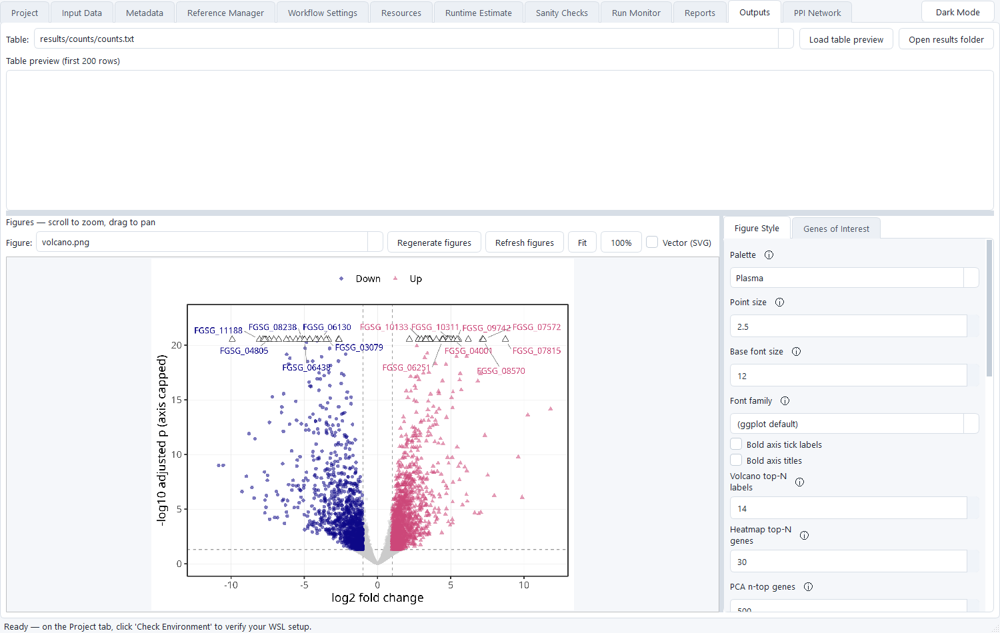
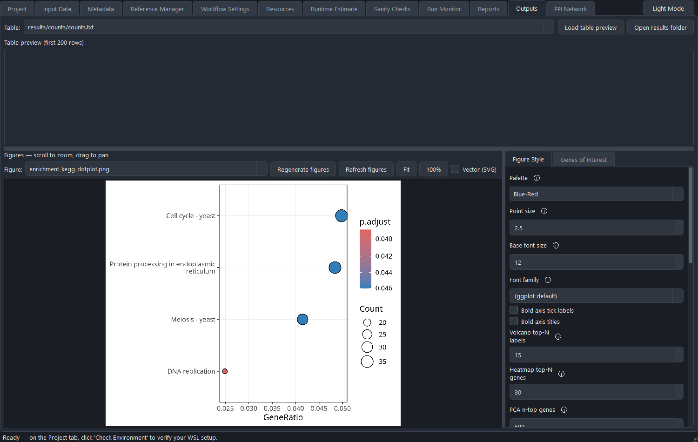
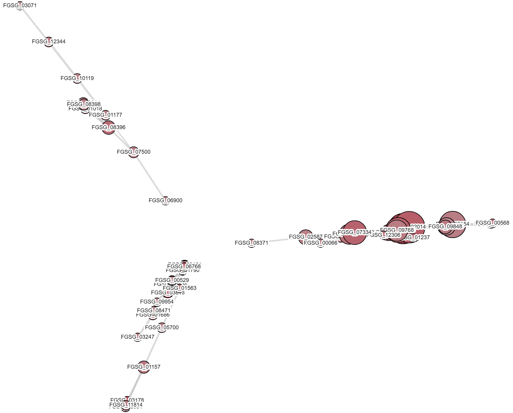

# BulkSeq Studio

A Windows desktop app for reproducible, reference-based **bulk RNA-seq analysis** — from raw FASTQ/SRA reads to differential expression, functional enrichment, and publication figures, with no command line required.

BulkSeq Studio is a PySide6 GUI that drives a transparent [Snakemake](https://snakemake.github.io/) pipeline running inside WSL2. You point it at your data and reference, and it produces a count matrix, DESeq2 results, GO/KEGG enrichment, and figures — while recording the exact parameters, tool versions, and environment so a run can be reproduced later.



## Features

- **End-to-end pipeline** — ENA/SRA FASTQ download → FastQC/MultiQC → fastp trimming → STAR alignment (genome-size-aware index) → featureCounts → DESeq2 → GO/KEGG enrichment → figures, orchestrated by Snakemake.
- **No command line needed** — a tabbed GUI walks you from project setup through metadata, reference selection, a sanity-check gate, and an interactive Outputs browser. The Run Monitor shows a plain-language current phase (Downloading, Aligning, DESeq2, …) above the raw log.
- **Sizes itself to your machine** — resource recommendations are based on the WSL2 VM's real RAM/CPU caps (not the Windows host total), so memory-heavy steps like STAR don't over-subscribe and thrash. A runtime estimate is shown before you start.
- **Fetch a study from its accession** — paste SRR/SRP/PRJ accessions and the ENA metadata fetch builds the sample sheet (layout, FASTQ URLs, read counts) for you.
- **Start from a count matrix** — already have counts? Upload a gene × sample table (featureCounts output or any TSV/CSV) to skip download/QC/alignment and go straight to DESeq2 → figures → enrichment.
- **GEO microarray (GSE)** — enter a GEO series accession and the app ingests the normalized intensities (GEOquery series matrix, or RMA from raw Affymetrix CEL), maps probes to gene symbols, and runs **limma** differential expression — then the same figures, enrichment, and genes-of-interest. RNA-seq series are redirected to the SRA box.
- **Differential expression with DESeq2** — apeglm shrinkage, VST, configurable significance thresholds (`alpha`, `|log2FC|`), and separate up- and down-regulated gene lists.
- **Directional functional enrichment** — GO over-representation and GSEA (clusterProfiler) run separately on the up- and down-regulated sets. **Selecting an organism preset auto-configures its enrichment databases and STRING taxon**, so **KEGG pathway ORA + GSEA run for any organism with a KEGG code** (fungi, bacteria, yeast, … e.g. *Fusarium graminearum*, code `fgr`) and **GO + Reactome are available even without a Bioconductor OrgDb, via g:Profiler** (`gprofiler2`). Organisms with an installed OrgDb (human, mouse, fly) use clusterProfiler and additionally get disease-ontology terms, so an organism is no longer skipped just because it lacks an OrgDb. Enrichment figures (GO and KEGG dotplots, GSEA running-score, ridgeplot, gene-concept and term-similarity networks) are rendered with enrichplot / ggplot2.
- **Interactive protein-interaction network** — a dedicated PPI Network tab embeds the STRING network in an interactive [cytoscape.js](https://js.cytoscape.org/) view: hover a protein for its symbol, mean expression, log2 fold-change, adjusted p-value, degree and module; drag, zoom and re-layout (fcose/cose/circle/…); recolour by fold-change or module, resize by degree / expression / significance, filter by confidence, and export PNG or SVG (white or transparent background). The same network also exports to Cytoscape (GraphML / SIF / cytoscape.js JSON) for external editing.
- **More statistics** — sample-to-sample correlation heatmaps (Pearson and Spearman's ρ), a Wilcoxon rank-sum concordance diagnostic, TOST equivalence testing to flag genuinely unchanged genes, MSigDB Hallmark set-overlap, and disease-ontology (DO) enrichment for human and mouse.
- **Genes of interest** — supply a gene list to get a focused z-scored heatmap and per-condition expression panel, generated from an existing run without re-analysis.
- **Publication figures** — PCA, sample-distance, MA, volcano, top-DEG heatmap, a raw p-value histogram, and (RNA-seq) dispersion / Cook's-distance / library-size diagnostics, each exported as PNG (raster) and SVG (vector, with a crisp in-app preview toggle). A built-in **Figure Style** editor (palette, fonts, sizes, point size, label counts, dimensions in in/cm/px, DPI) re-renders figures with **Regenerate figures** — without re-running alignment or DESeq2.
- **Gene symbols and biotypes** — the DE table and figures are labelled with gene symbols and carry a biotype column (parsed from the reference GTF), not just gene IDs; genes of interest match either IDs or symbols.
- **Downstream exports** — a normalized-expression matrix (VST counts, or log2 intensities for microarray) as CSV, plus a stat-ranked `.rnk` for preranked GSEA, alongside the DESeq2/limma results table.
- **Low-mapping safeguard** — if a sample aligns poorly (uniquely-mapped rate below a threshold, usually a wrong reference or contamination), the run pauses and asks whether to stop or continue, instead of silently wasting hours.
- **Reproducibility built in** — every run records a default-vs-used parameter diff, software versions, an environment lock hash, the reference accession/MD5, and R `sessionInfo`. The conda environment is pinned in `workflow/envs/bulkseq.lock.yaml`.
- **Light & dark themes**, a resizable Outputs workspace, and a window that remembers its size.

The default **STAR → featureCounts → DESeq2 → enrichment → figures** route (and the count-matrix and **GEO microarray → limma** routes) are implemented and validated (see [Validation](#validation)). HISAT2, Salmon/tximport, SortMeRNA, htseq-count, and edgeR/limma-voom for RNA-seq are defined as alternatives but are not the validated path.

## Screenshots

From data to results in one window — bring in a study, configure the analysis, run it while watching progress by phase, then browse tables and publication figures. The same workflow in dark mode:



The interactive PPI Network tab — hover a protein for its expression and fold-change, recolour and resize the nodes, filter by confidence, and export:



## Requirements

- Windows 10/11 (x64).
- [WSL2](https://learn.microsoft.com/windows/wsl/install) with a Linux distribution. The app can enable WSL2 and install the bioinformatics environment for you from its setup screen.
- ~10 GB free disk for the toolchain and reference indices; 16 GB+ RAM recommended (STAR alignment is the memory-intensive step).

The bioinformatics tools (Snakemake, STAR, featureCounts, samtools, fastp, FastQC, MultiQC, DESeq2, clusterProfiler, …) install into a pinned micromamba environment inside WSL2; the Windows side only runs the GUI.

## Install

Download the latest build from the [**Releases**](https://github.com/tunabirgun/bulkseq-studio/releases/latest) page — two options:

- **Installer** — `BulkSeqStudio-Setup-<version>.exe`. Per-user install (no administrator rights); launch from the Start Menu.
- **Portable** — `BulkSeqStudio-Portable-<version>.zip`. Unzip anywhere and double-click `BulkSeq Studio\BulkSeqStudio.exe`. No installation.

(Or build them yourself with `scripts\build_release.ps1`.)

On first launch the app runs a readiness check and can install the WSL2 environment for you. Only enabling WSL itself asks for elevation (Windows requires it); normal use does not run as administrator.

### Run from source (development)

```powershell
python -m venv .venv
.\.venv\Scripts\Activate.ps1
pip install -r requirements.txt
python -m app.main
```

## Quick start

1. **Project** — create a project folder (the app scaffolds `config/`, the Snakemake `workflow/`, and a provenance manifest).
2. **Input Data** — select FASTQ files, or paste SRR/SRP/PRJ accessions and click *Fetch metadata & build samples*. Already have counts? Click *Use a Count Matrix (skip alignment)*. For a **GEO microarray** study, enter a GSE accession and click *Fetch a GEO microarray series* — the pipeline ingests the intensities and runs limma → figures → enrichment.
3. **Metadata** — assign each sample a `condition` and check the layout (paired/single) in the editable table.
4. **Reference Manager** — pick an organism from the catalog (Ensembl / NCBI RefSeq) or import a custom genome + annotation.
5. **Workflow Settings** — set the DESeq2 design and contrast, `alpha`, and `|log2FC|` threshold.
6. **Sanity Checks** — resolve any flagged issues before running.
7. **Run Monitor** — start the pipeline and watch progress.
8. **Outputs** — browse the count matrix and DESeq2 table, view/zoom figures (toggle *Vector (SVG)* for a crisp preview at any zoom), restyle and regenerate them, and define genes of interest.

> Tip: for best I/O, keep the project on the WSL filesystem rather than a Windows drive
> (`/mnt/c`, which is slower over the 9P boundary). On the **Project** tab, click *Use WSL
> filesystem* to set the working directory to `\\wsl.localhost\<distro>\home\<user>\…`; this
> is the default when WSL2 is detected. A Windows folder still works, with a speed warning.

> A reference is required — the run will not start until you select a preset
> organism (and click *Use Selected Preset*) or import a custom genome + annotation
> on the **Reference Manager** tab.

> When a run starts, a WSL/terminal console window may briefly appear (the app
> launches Snakemake inside WSL2). The packaged app hides it, but on some Windows
> setups it can still flash on screen. This is normal — do not close that window
> manually, as doing so kills the running pipeline. Use the **Stop** button in the
> app to cancel a run instead.

### Run the pipeline from a terminal

A project is a plain Snakemake workspace, so you can also run it directly:

```bash
cd /path/to/project
snakemake --cores 8 --resources mem_mb=24000 --configfile config/config.yaml
```

## Validation

The pipeline is validated end-to-end on two real datasets:

- **Drosophila — pasilla** (Ensembl): 467 DE genes, the *pasilla* gene strongly down-regulated, all sanity checks PASS. The four-sample subset ships as a one-click benchmark project (`examples/benchmarks/pasilla_paired_subset`).
- **Fusarium graminearum — spore vs mycelium** (SRP039087; PH-1, NCBI RefSeq): clean PC1 = 98% separation, 5,734 DE genes (2,723 up / 2,478 down at |log2FC| > 1), top hits at log2FC 11–14, consistent with the known conidium↔mycelium developmental transition.

Both runs reproduce byte-for-byte across pipeline revisions, confirming the analysis is deterministic.

## Project layout

| Path | Contents |
| --- | --- |
| `app/` | PySide6 GUI (`app/ui/`), core logic (`app/core/`), bundled data (`app/data/`). |
| `workflow/` | Snakemake `Snakefile`, `rules/`, R/Python `scripts/`, pinned conda envs (`envs/`). |
| `examples/benchmarks/` | Ready-to-run benchmark project templates. |
| `packaging/`, `scripts/` | PyInstaller spec, Inno Setup script, build/setup/release scripts. |

## License

See [`LICENSE`](LICENSE).
