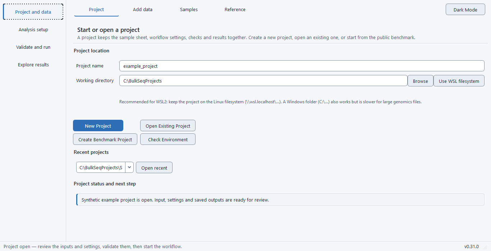

# BulkSeq Studio

[](https://github.com/tunabirgun/bulkseq-studio/releases) [](https://www.python.org/) [](https://snakemake.readthedocs.io/) [](LICENSE) [](https://github.com/tunabirgun/bulkseq-studio/actions/workflows/tests.yml) [](https://github.com/tunabirgun/bulkseq-studio/actions/workflows/environment.yml)

BulkSeq Studio is a cross-platform desktop application for reproducible bulk RNA-seq and microarray analysis. Its PySide6 interface drives a transparent Snakemake workflow from raw reads or processed inputs through differential expression, enrichment, protein-interaction networks, figures, reports, and route-aware provenance.

> **Release status — 18 September 2026.** Version 0.32.0 is the current public release. Use only the checksummed packages published on GitHub Releases. The separately versioned B1–B20 validation archive remains deposited as version 0.26.6 on Zenodo.

[Read public v0.32.0 handbook](https://tunabirgun.github.io/bulkseq-studio/) · [Download public v0.32.0](https://github.com/tunabirgun/bulkseq-studio/releases/latest) · [Report an issue](https://github.com/tunabirgun/bulkseq-studio/issues) · [Changelog](CHANGELOG.md)

The release candidate passed the repository Tests, Environment, Build packages, and documentation deployment workflows on GitHub Actions. The downloadable packages are built by the successful Build packages workflow for the published commit; verify every download against `SHA256SUMS.txt`.



## What it covers

| Area | Supported routes |
| --- | --- |
| Inputs | Local single- or paired-end FASTQ; SRA/ENA accessions; RNA-seq GEO series; raw count matrices; processed microarray matrices; imported differential-expression tables |
| Read processing | FastQC/MultiQC; fastp, Trim Galore, or Trimmomatic; optional SortMeRNA or RiboDetector; optional FastQ Screen and RSeQC |
| Quantification | STAR, HISAT2, or Salmon; featureCounts, STAR gene counts, or Salmon/tximport |
| Differential expression | DESeq2 by default; optional limma-voom and edgeR quasi-likelihood; limma for microarrays; optional multi-study meta-analysis |
| Interpretation | Directional GO/KEGG and custom-gene-set enrichment, GSVA, STRING networks, publication figures, sortable reports with native keyboard-operated column-header buttons and figure viewers, and Cytoscape exports |
| Reproducibility | Pinned workflow environment, content-fingerprinted pre-run validation, default-versus-used parameter records, active-route tool and reference provenance, R session details, and a `bulkseq run` command line that executes the same command the interface would |

The interface groups twelve pages into four stages: **Project and data**, **Analysis setup**, **Validate and run**, and **Explore results**.

The 0.32.0 interface update gives the accession, differential-expression, output, figure-preview and PPI edge-filter controls specific Qt accessible names and descriptions. Composite workflow labels are programmatically associated with their fields, and the accession editor follows normal Tab navigation. Report tables retain column and row headers, and their native sort buttons work with mouse, Enter and Space. The current-view edge filter’s 0–100 slider maps to displayed confidence 0.00–1.00 and does not rebuild the network. These checks exercise Qt's accessibility interface and keyboard focus; they do not replace a native screen-reader session.

## Documentation

The handbook at **[tunabirgun.github.io/bulkseq-studio](https://tunabirgun.github.io/bulkseq-studio/)** is the complete reference. It is organised as a tutorial, how-to guides, reference and explanation, and each page states the release it documents.

Backend environment setup writes its persistent log in the current user's BulkSeq Studio application-data directory, separate from the installed or portable application files. Open **Show details / log** and choose **Load setup log** when a setup attempt needs review. After a tool, R or import verification failure, setup can make one in-place repair using the same installed specification, then rechecks it. Post-link steps can redownload required files; an unresolved verification failure remains failed. Run provenance records `lock` only when the exact linux-64 lock was installed; a floating-spec install records `fallback`, including a direct native Linux ARM install, with the actual specification filename and SHA-256. The published AppImage remains x86-64; this marker correction does not establish an ARM package or end-to-end ARM run.

- **Tutorial** — [your first analysis](https://tunabirgun.github.io/bulkseq-studio/tutorial.html): one complete run of a bundled four-sample study, with a recorded result to check your own against
- **How-to guides** — [install and first run](https://tunabirgun.github.io/bulkseq-studio/guide.html), the [walkthrough](https://tunabirgun.github.io/bulkseq-studio/walkthrough.html) for each of the five starting points, [input routes](https://tunabirgun.github.io/bulkseq-studio/inputs.html), [experimental design](https://tunabirgun.github.io/bulkseq-studio/design.html), and [command line and HPC profiles](https://tunabirgun.github.io/bulkseq-studio/cli.html)
- **Reference** — [pre-run checks](https://tunabirgun.github.io/bulkseq-studio/checks.html), [outputs and provenance](https://tunabirgun.github.io/bulkseq-studio/outputs.html), and [troubleshooting, version notices and citation](https://tunabirgun.github.io/bulkseq-studio/faq.html)
- **Explanation** — [what the workflow checks for you](https://tunabirgun.github.io/bulkseq-studio/safeguards.html), [choosing a differential-expression engine](https://tunabirgun.github.io/bulkseq-studio/engines.html), [what the numbers mean](https://tunabirgun.github.io/bulkseq-studio/interpreting.html), and [reproducibility and provenance](https://tunabirgun.github.io/bulkseq-studio/provenance.html)

## Scientific safeguards

A successful run means the computation completed. The study design, quality checks and interpretation still require review. The application is built so that the record of what it did survives the run.

- **Validation is revalidated.** Pre-run checks store content fingerprints for the configuration, sample sheet, local inputs, reference locks and index files; starting or resuming revalidates them, so a replaced or edited input cannot inherit an earlier pass.
- **Strandedness is per sample.** Each sample's library type is inferred from its own data and applied with its own featureCounts orientation, and a project mixing library types is named rather than forced onto one code.
- **Unmodelled structure is screened.** For every sample-sheet column outside the design formula, the workflow tests that column against the run's principal components and reports the result. The screen is advisory and engine-relative: two engines can reach different verdicts on the same samples.
- **Alternative-engine contrasts preserve condition identity.** edgeR, limma-voom and microarray limma form the configured numerator-minus-denominator comparison by factor position, so distinct condition levels containing spaces, hyphens or dots remain distinct even when they share an R-safe spelling. Internal model names also prevent a sample-sheet column named `grp` from replacing the configured contrast factor and keep group and covariate coefficients unique. The fitted model remains the documented additive group-means design; interaction terms remain unsupported by these engines.
- **Imported results are not relabelled.** An imported differential-expression table is validated in full, bound to its hash and schema, and its report never claims a model the application did not fit.
- **Ranked enrichment is independent of the ORA family.** GSEA retains an independently filtered row when its adjusted p-value is missing but its route-specific rank and raw p-value are finite. The ORA tested universe and foregrounds stay unchanged. An additional adjusted-p-missing row without a finite raw p-value, including a DESeq2 Cook's-distance outlier, remains excluded; legacy adjusted-p-finite rows retain their supported eligibility. Custom GSEA continues to rank on log2 fold change. On fallback KEGG routes, source aliases are reduced once after the final GeneID bridge, which can change an already-ranked alias group as well as admit newly eligible rows.
- **Count matrices are validated before conversion.** Missing, nonnumeric, nonfinite and negative cells are refused before a project copy or count output is written. Any non-integer value requires the explicit RSEM/tximport estimated-count declaration and is then rounded with the documented round-half-to-even rule. Column totals near one million raise a normalized-data warning but do not by themselves classify valid integer counts as TPM.
- **Ambiguous microarray probes are excluded.** GEO platform annotation is parsed across every listed candidate and every row for a probe. Only probes resolving to one distinct gene enter the established MaxMean collapse; ambiguous, unknown and missing mappings remain in the probe-map evidence and are counted by check 12. Local gene-level matrices retain their supplied identifiers directly.
- **Meta-enrichment foregrounds match the per-study tables.** Cross-study enrichment applies the configured meta-analysis FDR and absolute log2-fold-change thresholds to each study, including exact threshold boundaries; zero effect remains neutral when the threshold is zero. It then restricts the published up/down selections to the shared tested universe and the same ambiguity-aware accepted identifier mappings used by the main enrichment route. Unresolved one-to-many mappings are excluded consistently from the universe and every foreground, retained in `results/meta/meta_enrichment_mapping.tsv`, and reported as review-required by check 18 even if enrichment later skips.
- **Wilcoxon sensitivity remains diagnostic.** The matrix-based rank-sum check reports a warning for small groups because exact p-values are discrete and power is limited; it is a rank-concordance check rather than a thresholded DEG call. The warning wording does not alter the Wilcoxon statistics, adjusted p-values or differential-expression calls.
- **Provenance names what ran.** The run summary records the app and workflow version that actually executed, the execution-tree digest separately from the bundled-workflow identity, the installed environment specification and the active route's tools and references. Workflow synchronization stops if a recorded project copy has local edits.
- **Project destinations are protected.** New projects must be immediate children of the selected working directory. An occupied directory requires explicit overwrite; an existing file is refused.
- **Command-line checks use the selected sample sheet.** `bulkseq project info`, `samples show`, and `check` read `input.samples`, including custom relative and absolute paths. `check` requires local FASTQ files on the FASTQ route and allows pending reads only for SRA and processed-input routes.

Results can differ between releases when a scientific output changes. Every such change is marked in [CHANGELOG.md](CHANGELOG.md) with a re-run notice, and the site's [version notices](https://tunabirgun.github.io/bulkseq-studio/faq.html#version-notices) list them by release.

## Benchmark archive and citation

The checksummed version 0.26.6 benchmark archive is deposited at DOI [10.5281/zenodo.21833538](https://doi.org/10.5281/zenodo.21833538). The concept DOI [10.5281/zenodo.20955660](https://doi.org/10.5281/zenodo.20955660) resolves to the latest deposited version. Cite the exact software version that produced your analysis, not the archive version, when reporting an analysis.

```text
Birgün, Tuna (2026). BulkSeq Studio: validation benchmark archive. Version 0.26.6. Zenodo.
https://doi.org/10.5281/zenodo.21833538
```

## License

BulkSeq Studio is released under the [MIT License](LICENSE).
