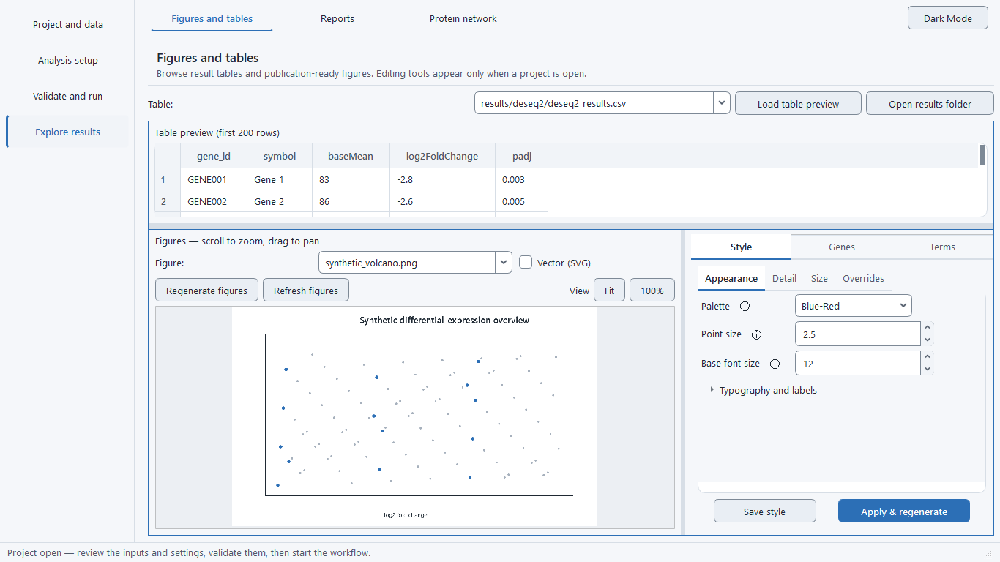

# BulkSeq Studio

BulkSeq Studio is a cross-platform desktop application for reproducible bulk RNA-seq and microarray analysis. Its PySide6 interface drives a transparent Snakemake workflow from raw reads or processed inputs through differential expression, enrichment, protein-interaction networks, figures, reports, and route-aware provenance.

> **Release status — 10 September 2026.** Version 0.29.1 is the current public release. Use only the checksummed packages published on GitHub Releases. The separately versioned B1–B20 validation archive remains deposited as version 0.26.6 on Zenodo.

[Read the complete documentation](https://tunabirgun.github.io/bulkseq-studio/) · [Download public v0.29.1](https://github.com/tunabirgun/bulkseq-studio/releases/latest) · [View source](https://github.com/tunabirgun/bulkseq-studio) · [Report an issue](https://github.com/tunabirgun/bulkseq-studio/issues)



## What it covers

| Area | Supported routes |
| --- | --- |
| Inputs | Local single- or paired-end FASTQ; SRA/ENA accessions; RNA-seq GEO series; raw count matrices; processed microarray matrices; imported differential-expression tables |
| Read processing | FastQC/MultiQC; fastp, Trim Galore, or Trimmomatic; optional SortMeRNA or RiboDetector; optional FastQ Screen and RSeQC |
| Quantification | STAR, HISAT2, or Salmon; featureCounts, STAR gene counts, or Salmon/tximport |
| Differential expression | DESeq2 by default; optional limma-voom and edgeR quasi-likelihood; limma for microarrays; optional multi-study meta-analysis |
| Interpretation | Directional GO/KEGG and custom-gene-set enrichment, GSVA, STRING networks, publication figures, sortable reports, and Cytoscape exports |
| Reproducibility | Pinned workflow environment, content-fingerprinted pre-run validation, default-versus-used parameter records, active-route tool and reference provenance, and R session details |

The redesigned interface groups twelve pages into four stages: **Project and data**, **Analysis setup**, **Validate and run**, and **Explore results**. Light and dark themes apply immediately, compact windows retain every task, and the protein-network view supports pointer and keyboard navigation.

## Start here

- [Install and run a first analysis](https://tunabirgun.github.io/bulkseq-studio/guide.html)
- [Choose analysis options](https://tunabirgun.github.io/bulkseq-studio/analysis.html)
- [Understand outputs and provenance](https://tunabirgun.github.io/bulkseq-studio/outputs.html)
- [Use the command line or an HPC profile](https://tunabirgun.github.io/bulkseq-studio/cli.html)
- [Read the FAQ and citation guidance](https://tunabirgun.github.io/bulkseq-studio/faq.html)

## Scientific safeguards and boundaries

Imported differential-expression tables are validated in full rather than from a preview. The importer requires unique safe identifiers and finite, in-range numeric values; records the source numerator and denominator for positive log2 fold change; binds the project copy to its hash, size, row count, and schema; and prevents stale local contrast settings from reinterpreting the imported direction. Imported-result reports do not claim that BulkSeq Studio fitted DESeq2, performed shrinkage, or used Benjamini–Hochberg unless that upstream information was supplied. Imported `.rnk` files use the confirmed `log2FoldChange`; locally fitted routes retain their model statistic.

Successful pre-run checks store content fingerprints for the configuration, configured sample sheet, local inputs, reference locks, and index files. Starting or resuming a run revalidates that state, so a replaced, edited, missing, unreadable, or unsafe linked input cannot inherit an earlier pass.

> **Meta-analysis correction.** Releases before 0.26.6 adjusted p-values across every gene and then removed direction-discordant genes from the called set. Re-run any multi-study result produced with 0.26.5 or earlier. Single-study differential expression, enrichment, and network output are unaffected.

> **0.29.0 output changes.** GSEA now ranks on the model test statistic, STRING seeding is split by direction in adjusted-p order, meta-analysis combined p-values are computed in tail form so strongly concordant genes are ranked instead of tied at zero, and genes-of-interest heatmaps use a zero-anchored colour scale. Results produced with 0.28.0 or earlier can differ in enrichment tables, network membership, and figure ordering; re-run before publishing. [CHANGELOG.md](CHANGELOG.md) lists every change in the release.

### What changed in 0.29.0

- GO, KEGG, and custom GSEA rank genes on the signed model test statistic (DESeq2 Wald, limma or voom moderated *t*, edgeR signed root-F), the metric the exported preranked file already used; the enrichment summary names the ranked column.
- STRING seeding divides the seed cap between the up- and down-regulated genes in adjusted-p order, passing unused budget from the smaller direction to the larger one, and records the realized up and down seed counts in the network provenance.
- The meta-analysis inverse-normal combination is computed in tail form, so a combined |Z| above about 8.3 no longer collapses to exactly zero and the most significant genes are ordered by evidence; the p-value still reaches exactly zero once the combined |Z| exceeds about 38, which requires per-study p-values near the double-precision floor (an exact 0 from DESeq2 is clamped to 2.2e-308, |Z| 37.5), and the meta-volcano marks such genes as off-scale.
- Genes-of-interest and enrichment-term heatmaps use a zero-anchored, symmetric colour scale, matching the top-DEG heatmap.
- The volcano plot uses the unshrunken effect, so its guides, colouring, and ranked side key share the coordinate the up- and down-regulated tables report; the MA plot keeps every gene with a finite mean, including the independently filtered low-count cloud.
- KEGG over-representation and KEGG GSEA are audited and reported per leg, so a comparison with too few significant genes for over-representation still returns its ranked-list pathways.
- A local microarray matrix with text tokens or comma decimals is refused, with the offending values named, rather than silently converted.
- A design term that holds only numeric values is fitted as a continuous trend; the design check now flags it for review and the design helper labels the column.
- The SortMeRNA rRNA database and micromamba are fetched at pinned versions and verified against recorded SHA-256 digests before use.
- Check Environment reports against the installed profile, so full-only tools and the R stack read as not applicable on a core environment instead of as failures.
- The Windows installer refuses to run while BulkSeq Studio is open, so an update cannot remove the previous version and then abort on a file in use.

The deposited B1–B20 validation suite belongs to version 0.26.6. Its multi-study result depends on replication: at five replicates per group the combination gained 11–37 true positives over the best constituent study in ten of ten runs, whereas at ten replicates it ranged from 16 fewer to 14 more and failed that power criterion in five of ten. Complete-null calibration was not established for the smallest design: two-study combinations at five replicates per group rejected in 2 of 5 independent seeds, with an exact lower confidence limit of 0.053 that failed the criterion; three-study combinations rejected in 1 of 5. Both strata fell inside the bound at ten replicates. All 1,326 observably opposite-direction planted genes were flagged and none was called. The real two-study dexamethasone arm is corroborative, not a general power claim.

The archived benchmark tables, negative controls, method-specific qualifications, and platform limits remain available in the checksummed Zenodo deposition cited below. The deposited 0.26.6 archive's enrichment tables, STRING network membership, and volcano/MA/genes-of-interest figures predate the 0.29.0 GSEA-ranking, seed-splitting, and colour-scale changes and will be regenerated in a later archive version; the differential-expression gene counts are unchanged.

## Benchmark archive and citation

The checksummed version 0.26.6 benchmark archive is deposited at DOI [10.5281/zenodo.21833538](https://doi.org/10.5281/zenodo.21833538). The concept DOI [10.5281/zenodo.20955660](https://doi.org/10.5281/zenodo.20955660) resolves to the latest deposited version.

```text
Birgün, Tuna (2026). BulkSeq Studio: validation benchmark archive. Version 0.26.6. Zenodo.
https://doi.org/10.5281/zenodo.21833538
```

## License

BulkSeq Studio is released under the [MIT License](LICENSE).
