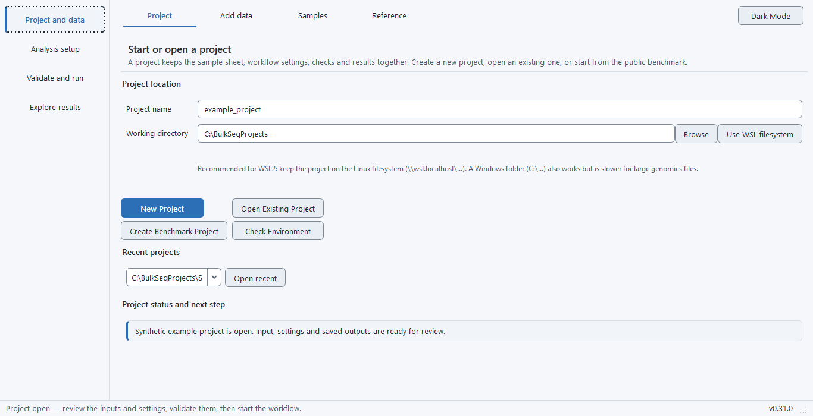

# BulkSeq Studio

    

BulkSeq Studio is a desktop application for Windows and Linux that manages bulk RNA-seq and microarray analyses. Its PySide6 interface runs a recorded Snakemake workflow from raw reads or processed inputs through differential expression, optional enrichment and networks, figures, checks and reports.

> **Release status — 3 October 2026.** This documentation describes version 0.34.0. It corrects the Benjamini–Hochberg family for pooled-effect meta-analysis adjusted p-values; affected older meta results require recomputation. Synthetic and independent numerical checks support the correction, but the nine bundled biological datasets have not been rerun under 0.34.0. The counts below are the measured 0.33.0 baseline. Check the [official release record](https://github.com/tunabirgun/bulkseq-studio/releases) for available packages before installing.

[Read the handbook](https://tunabirgun.github.io/bulkseq-studio/) · [Download from official releases](https://github.com/tunabirgun/bulkseq-studio/releases/latest) · [Changelog](CHANGELOG.md) · [Report an issue](https://github.com/tunabirgun/bulkseq-studio/issues)

## Install and begin

The published packages target x86-64 Windows and Linux. The Windows GUI installer accepts Windows 10 build 17763 (version 1809) or later, while its automatic `wsl --install` path needs Windows 10 build 19041 (version 2004) or later, or Windows 11, according to [Microsoft's WSL installation requirements](https://learn.microsoft.com/en-us/windows/wsl/install). The GUI floor does not mean WSL2 local analysis works on Windows 10 1809. Local Windows analysis runs in WSL2. The Linux AppImage needs glibc 2.38 or newer; a portable archive is another packaged option. macOS CI exercises the GUI and configuration layer, but there is no supported macOS installer or verified native analysis backend. Read the [installation guide](https://tunabirgun.github.io/bulkseq-studio/guide.html) before choosing a package. The unsigned Windows packages may prompt SmartScreen. Close the application before an in-place installer update; the installer does not automatically uninstall the old version or recursively delete its directory. Keep projects and their provenance outside the application directory.

On first launch, use **Check Environment** to install or verify the analysis tools and the R/Bioconductor stack needed by your route. A working window alone does not establish that the backend is ready. For the linux-64 full environment, setup records `lock` only after its installed Conda package versions/builds and four pip pins match the exact lock, in addition to the tool and R load checks. A mismatch gets one bounded reinstall and recheck; unresolved drift fails setup. Extra packages are reported, never silently pruned by the validator. If the exact lock cannot be used, the installed floating specification is recorded as `fallback`, not as a lock match. Read **Show details / log** if setup reports Action needed, then recheck. Keep projects outside the installed application directory.

Create a project, choose the input route, review the sample sheet, set a compatible reference and a directionally defined comparison, then save Analysis settings and Resources. Run **Validate current run inputs** before **Start Run**. Read the named findings instead of treating a completed command as scientific validation. The [first-run tutorial](https://tunabirgun.github.io/bulkseq-studio/tutorial.html) and [interactive route walkthrough](https://tunabirgun.github.io/bulkseq-studio/walkthrough.html) show those steps in the interface.

## Supported starting data

| Route | What the application does | Input boundary |
| --- | --- | --- |
| Local FASTQ | Read QC, optional trimming, alignment or Salmon quantification, count modelling | Single- or paired-end reads; one run must use one layout |
| Public accessions | Retrieves ENA/SRA reads and suggested metadata, then follows the read route | Review study identity, conditions, mates and biological replicates before analysis |
| Raw count matrix | Skips read processing and fits a count model | Raw unnormalized counts; estimated counts require the explicit RSEM/tximport declaration |
| Microarray | Uses a supported GEO array route or processed gene-by-sample intensities, then limma | Confirm platform, normalization and log transformation |
| Imported differential-expression table | Uses supplied statistics for applicable downstream outputs without a local DE fit | Confirm upstream method, adjusted-p procedure and log2FC direction; no counts or sample PCA are reconstructed |

The count-based engines are DESeq2 by default, with limma-voom and edgeR quasi-likelihood options. Read processing offers STAR, HISAT2 or Salmon where appropriate. GO/KEGG, custom gene sets, GSVA, STRING networks and optional QC modules depend on the route, organism, identifiers and installed tools. The [input guide](https://tunabirgun.github.io/bulkseq-studio/inputs.html) names what each route skips.

## Follow the four stages

1. **Project and data:** Create or open a project, add the input, and review each sample's ID, condition, study of origin and file or matrix column. A sequencing lane is not an independent study or biological replicate.
2. **Analysis setup:** Confirm the selected factor, numerator, denominator, formula and thresholds. Positive log2 fold change means higher expression in the numerator. Optional modules must match the data and annotation available.
3. **Validate and run:** Save current inputs, inspect checks and a dry-run plan, then run or resume. Changed saved inputs make an earlier preflight stale. A dry run does not prove remote services or a large rule will succeed.
4. **Explore results:** Open the main report, full tables and figures. If a cross-study report exists, it remains directly available even when the current checkbox is off. Read warnings and provenance before sharing an export.

The [checks reference](https://tunabirgun.github.io/bulkseq-studio/checks.html) defines `PASS`, `WARNING`, `REVIEW_REQUIRED`, `FAIL` and the interface's `STALE` state. Missing or malformed recorded evidence is not a pass. On a requested meta run, check 01 must be valid and report `PASS` or `WARNING` before per-study fitting; `REVIEW_REQUIRED`, `FAIL`, missing and malformed evidence stop that branch. The [command-line guide](https://tunabirgun.github.io/bulkseq-studio/cli.html) covers local execution and remote profiles; the GUI's full preflight is not implied by a direct `bulkseq run`.

## Cross-study meta-analysis

Assign every sample a `dataset` study-of-origin value and use the **Add/review study column** action to inspect it. Analysis settings shows a **current-editor preview** of the selected contrast, replicate counts and eligible or excluded studies. That preview is about metadata and supported model structure; authoritative run validation checks saved inputs. It does not establish study independence, comparable biology or a valid result. The duplicate-study screen reports assessed, partial or unassessed coverage; silence without complete evidence is not proof of independence.

Each eligible study needs at least two samples in each compared arm, and at least two studies must remain. The per-study DESeq2 design supports an intercept and the selected comparison factor; the requested meta formula may additionally include additive `dataset`, which is constant and omitted within a study. Extra covariates, interactions and transformations are refused rather than silently dropped. Keep scientifically required covariates in the joint analysis and turn off meta-analysis when the restricted per-study model is unsuitable. The joint fit's recorded engine and design are separate from the per-study fits.

The combined-p result uses replicate-weighted inverse-normal evidence and BH adjustment over matching-sign genes. A combined-FDR hit also requires matching nonzero effect directions, but does **not** prove that each study is significant or independently replicated. The pooled-effect result combines unshrunken log2 fold changes: two studies use a common-effect fit; three or more use DerSimonian–Laird random effects. Its `rem_padj` is BH-adjusted across **every estimable pooled test**, including opposite-sign and neutral rows. It is a different testing family from the combined-p FDR and does not decide `meta_sig`. The method ledger records both families and their sizes.

Open `results/reports/meta_analysis_report.html` for the executed factor, direction, included and excluded studies, method limits, figure sources and recorded thresholds. Older results without the corrected pooled-method marker need recomputation before `rem_padj` is interpreted; missing legacy orientation is reported as not recorded. See the [cross-study guide](https://tunabirgun.github.io/bulkseq-studio/meta-analysis.html) and the [0.34.0 changelog](CHANGELOG.md).

## Read and preserve results

| Location | What to inspect |
| --- | --- |
| `results/deseq2/` | Complete route-specific differential-expression table before selected up/down lists; check the recorded engine and contrast |
| `results/meta/` | Separate study tables, pooled and combined statistics, eligibility ledger and mapped enrichment evidence when meta-analysis ran |
| `results/figures/` | PNG and SVG exports; captions and available matching source tables describe what a plot shows |
| `results/reports/` | Main HTML report, optional cross-study report, run summary, methods and software provenance |
| `checks/`, `config/`, `logs/` | Validation evidence, saved settings and execution logs needed to interpret or reproduce a result |

For custom gene-set ORA, the supplied background and selected list can be larger than the identifiers represented in the annotation. The summary distinguishes those supplied counts from the effective annotated populations; the report shows each term’s `GeneRatio` and `BgRatio`. This reporting correction does not change the enrichment selection or p-values. Direct Entrez IDs on OrgDb-backed routes also retain their mapping in 0.34.0; rerun an older analysis that failed at this step, because saved results do not update on their own.

An adjusted p-value is not the probability that one gene is false; the BH statement concerns a rejection set under its assumptions. A later raw fold-change screen does not automatically inherit that FDR guarantee. A non-significant gene is not an equivalence result. PCA and heatmaps describe sample structure or transformed expression when a matrix exists; STRING edges are functional associations, not measured physical binding in these samples. Read [what the numbers mean](https://tunabirgun.github.io/bulkseq-studio/interpreting.html) and [outputs and provenance](https://tunabirgun.github.io/bulkseq-studio/outputs.html) before making biological claims.

## Update a project

Close the application before installing a newer package. Preserve the original project and its `config/`, `checks/`, `logs/` and results before rerunning it. A newer bundled workflow is copied into an existing project when its version or verified content changes; a locally edited project workflow is protected rather than overwritten. The run summary records the application and workflow that actually executed. Revalidate the saved inputs and compare the [upgrade guide](https://tunabirgun.github.io/bulkseq-studio/upgrade.html) and [version notices](https://tunabirgun.github.io/bulkseq-studio/faq.html#version-notices) with your route. For pre-0.34.0 meta-analysis output, recompute before relying on pooled-effect adjusted values. Historical results do not acquire a new method merely because the application was upgraded.

## Historical bundled-dataset baseline

**Create Benchmark Project** offers nine public datasets. All nine were run from the installed **0.33.0 Windows package**; each completed without a FAIL. Seven carried-over datasets reproduced their 0.32.1 count and DE tables, or microarray limma table, byte for byte. These are historical measured results, not a 0.34.0 biological validation. Significant genes below are counted at adjusted p-value < 0.05 without a fold-change filter.

| Dataset | Route | Genes tested | Significant | 0.33.0 record |
| --- | --- | ---: | ---: | --- |
| Pasilla paired-end subset (*D. melanogaster*) | Reads, STAR, featureCounts, DESeq2 | 7,532 | 467 | Byte-identical to 0.32.1 and 0.31.0 |
| Yeast rpd3Δ Ume6Δ2-508 subset (*S. cerevisiae*) | Reads, STAR, featureCounts, DESeq2 | 5,967 | 97 | Byte-identical to 0.32.1 |
| Rice CY1000 salt-stress subset (*O. sativa* Japonica) | Reads, STAR, featureCounts, DESeq2 | 23,935 | 12,171 | Byte-identical to 0.32.1 |
| Arabidopsis hub2-3 vs Col-0, ATH1 microarray | GEO series matrix, limma | 21,323 | 1,401 | Byte-identical to 0.32.1 |
| Yeast cbc2Δ vs wild type, YG-S98 microarray | GEO series matrix, limma | 5,683 | 486 | Byte-identical to 0.32.1 |
| *F. graminearum* PH-1 spores vs mycelium | Reads, STAR, featureCounts, DESeq2 | 9,028 | 5,734 | Byte-identical to 0.32.1; 9 KEGG ORA and 31 GSEA pathways in 0.33.0 |
| *F. graminearum* Z-3639 heat shock | Reads, STAR, featureCounts, DESeq2 | 8,280 | 5,836 | Byte-identical to 0.32.1; 0 KEGG ORA and 11 GSEA pathways in 0.33.0 |
| *M. oryzae* ΔMocreA vs wild type (GSE153084) | Reads, STAR, featureCounts, DESeq2 | 9,777 | 4,778 | First recorded in 0.33.0 |
| Sorghum sulfur deficiency vs control (GSE184725) | Single-end reads, STAR, featureCounts, DESeq2 | 20,591 | 302 | First recorded in 0.33.0 |

Every historical run ended with `WARNING` or `REVIEW_REQUIRED` advisory findings rather than an overall `PASS`. The [tutorial](https://tunabirgun.github.io/bulkseq-studio/tutorial.html#other-datasets) gives their route-specific context.

## Citation and license

Cite the exact application and workflow versions in the run summary, the applicable method and tool references, and the [release record](https://github.com/tunabirgun/bulkseq-studio/releases) for the software that produced your result. BulkSeq Studio is released under the [MIT License](LICENSE).
